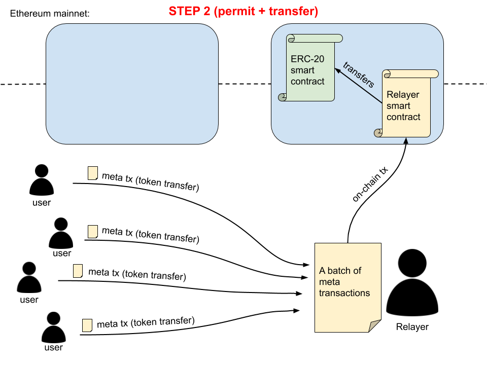

<!--
----
title: Backbone Cabal 
status soft proposal, draft
version: 0.2.8
platforms: sushiswap, yearn finance, keep3r
---
-->

# YCabal: Monopolizing transaction flow for arbitrage batching with miner support.

This is a strategy that realizes a profit by smart transaction batching for the purposes of arbitrage by controlling transaction ordering.

Right now every user sends a transaction directly to the network mempool and thus gives away the arbitrage, front-running, back-running opportunities to miners(or random bots).

YCabal creates a virtualized mempool (i.e. a MEV-relay network) that aggregates transactions (batching), such transactions include:

Potential benefits including offering zero-cost trading fees (meaning profits from arbitrage are used to pay for user’s transactions). Additional benefits and potential applications are further discussed in this proposal.

#### Important: Note that there are *two* diffrent uses of the concept of **batching**. For our purposes we use **batching** to denote the aggregation of transactions. Typically batching refers to the process of both aggregation of transactions for the purpose of reduced transactional cost. 

#### Forward Notes 

- Multiple systems are at play, but at the most basic is the RPC permissioned network. 

- Both on-chain contracts for arbitrage and off-chain infrastructure for calculating  arbitrage are used to varying degrees

- Further development of a *interprotocol clearing and call market* are touched upon in this document. The inital release vanidate of YCabal only concerns itself 
with the on-chain and off-chain components required to realize arbitrage profits.

Summary

> enter a summary of your proposal here

Abstract

> enter your proposal's abstract here

Motivation

> enter the motivation behind your proposal here

# YCabal

> Monopolizing transaction flow for arbitrage batching with miner support

## Overview

<pre>
Proposal: YCabal
Project: SushiSwap / DEX's
Status: Active
Version: Draft 0.4.0
Timeframe: 60d
</pre>

This is a strategy that realizes a profit by smart transaction batching for the purposes of arbitrage by controlling transaction ordering.

Right now every user sends a transaction directly to the network mempool and thus gives away the arbitrage, front-running, back-running opportunities to miners(or random bots).

YCabal creates a virtualized mempool (i.e. a MEV-relay network) that aggregates transactions (batching), such transactions include:

DEX trades <br>
Interactions with protocols <br>
Auctions <br>
etc <br>

#### TL;DR - Users can opt in and send transactions to YCabal and in return for not having to pay for gas for their transaction we batch process it and take the arbitrage profit from it. Risk by inventory price risk is carried by a Vault, where Vault deposits are returned the profit the YCabal realizes

## Background

Preliminary estimates obtained from MEV-Inspect show the following lower bounds:

10k of 443k blocks analyzed were wasted on inefficient MEV extraction
bots extracted 0.34 ETH of MEV per block through arbitrage and liquidations
18.7% of MEV extracted by bots is paid to miners through gas fees which makes up 3.7% of all transaction fees

## Efficiency by Aggregation

By leveraging batching, miner transaction flow, and providing additional performant utilities (e.g. faster calculations for finalizing),
we can realize the following potential avenues for realizing profitable activities:

- Meta Transaction Functionality
- Order trades in different directions sequentially to produce positive slippage
- Backrun Trades
- Frontrun Trades
- At least 21k in the base cost on every transaction is saved

> **If we have access to transactions before the network we can generate value because we can calculate future state, off-chain**

> Think of this as creating a Netting Settlement System (whereas blockchains are a real-time gross settlement system)

## User Capture

The whole point of Backbone Cabal is to maximize profits from user actions which gets distributed for free to miners and bots.

- We intend to extract this value and provide these profits as `**cashback**` to users.
- Another possibility is providing a 'boost' to user accounts that are farming. Basically use the profits to increase yield on farming activities to those who use the service and are farming an eligible market (this is sushiswap specific).

**For example**: A SushiSwap trader who loses `X%` to slippage during his trade can now get `X-Y %` slippage on his trade because we were able to back run his trade and give him the arbitrage profits.

Backbone Cabal gets better and better as more transactions flow because there is less uncertainty about the future state of the network.

### Gas Free Trading

- SushiSwap as an example

### Rebates

Profits can be rebated to end-users

### Volume Mining

Other protocols can join the network and turn their transaction flow into a book of business with our network of participants

<br>

### `skim(address)`

> UniSwapV2

[skim**address**](https://github.com/Uniswap/uniswap-v2-core/blob/master/contracts/UniswapV2Pair.sol#L190-L195)
lets anyone claim a positive discrepancy between the actual token balance in the contract and the reserve number stored in the Pair contract.

## Solution Set

ArcherDAO <br>
Manifold Finance <br>
Kafka based JSON RPC and API Gateway <br>
kdb+ <br>

## Attack Vectors against the Backbone

DDoS <br>
Exploits <br>
Additional Disclosures forthcoming <br>

## Ecosystem Benefits

- Can act as a failover web3 provider (e.g. Infura/AlchemyAPI outage)
- Transaction Monitoring
- Security Operations for Contracts

### User Example

Proposed end-user transaction example for interacting with the YCabal

> NOTE: Since the JSON-RPC spec allows responses to be returned in a different order than sent,
> we need a mechanism for choosing a canonical id from a list that
> doesn't depend on the order. This chooses the "minimum" id by an arbitrary
> ordering: the smallest string if possible, otherwise the smallest number, otherwise null.

```jsx
order = {
	Give: ETH,
	Want: DAI,
	SlippageLimit: 10%,
	Amount: 1000ETH,
	Cabal: 0xabc...,
	FeesIn: DAI,
	TargetDEX: SushiSwap,
	Deadline: time.Now() + 1*time.Minute
	Signature: sign(order.SignBytes())
}
```

Now if the Cabal broadcasts this transaction with an arbitrage order, the transaction contains 2 orders:

> Note: the transaction below is a mock-up for the proposed _data fields_

```jsx
transactions = [
	{
		Give: ETH,
		Want: DAI,
		SlippageLimit: 10%,
		Amount: 1000ETH,
		Cabal: 0xabc...,
		FeesIn: DAI,
		TargetDEX: SushiSwap,
		Deadline: time.Now() + 1*time.Minute
		Signature: sign(order.SignBytes())
	},
	{
		Give: DAI,
		Want: ETH,
		SlippageLimit: 1%,
		Amount: 10ETH,
		Cabal: 0xabc...,
		FeesIn: DAI,
		TargetDEX: SushiSwap,
		Deadline: time.Now() + 1*time.Minute
		Signature: sign(order.SignBytes()),
		IsBackbone Cabal: true,
		TransferProfitTo: transactions[0].signer
	}
]
```

The arbitrage profit generated by second order is sent to the `msg.sender` of the first order.

The first order will still lose 5%(assumption) in slippage.

Arbitrage profits will rarely be more than the slippage loss.

If someone front runs the transaction sent by the Cabal:

1. They pay for the gas while post confirmation of transaction the fees for order1 goes to the relayer in the signed order.
2. They lose 5% in slippage as our real user does.

## Engine

YCabal uses a batch auction-based matching engine to execute orders. Batch auctions were
chosen to reduce the impact of frontrunning on the exchange.

1. All orders for the given market are collected.

2. Orders beyond their time-in-force are canceled.

3. Orders are placed into separate lists by market side, and aggregate supply and
   demand curves are calculated.

4. The matching engine discovers the price at which the aggregate supply and demand
   curves cross, which yields the clearing price. If there is a horizontal cross - i.e., two
   prices for which aggregate supply and demand are equal - then the clearing price is the
   midpoint between the two prices.

5. If both sides of the market have equal volume, then all orders are completely filled. If
   one side has more volume than the other, then the side with higher volume is rationed
   pro-rata based on how much its volume exceeds the other side. For example, if
   aggregate demand is 100 and aggregate supply is 90, then every order on the demand
   side of the market will be matched by 90%.

Orders are sorted based on their price, and order ID. Order IDs are generated at post time and
is the only part of the matching engine that is time-dependent. However, the oldest order IDs
are matched first so there is no incentive to post an order ahead of someone else’s.

## Links

[Manifold RPC Inspector for Backbone Cabal](https://backbone-rpc.netlify.app/)

[Provisional Public API](https://ybackbone.netlify.app/)

[atlas engine[(https://github.com/backbonecabal/ycabal-docs/tree/master/offchain/atlas)


## Infrastructure 

Services

Each service is:

    Spring Boot application
    Retrieves the deployment-specific configuration properties from the Configuration Service
    Registers with the Discovery Service to allow discovery by API Gateway Service
    Communicates with other Application Services via the API Gateway Service

The table below identifies the location of the source code for each service within this repository.
Service 	Repository Location
Product Service 	atlas-product
Participant Service 	atlas-participant
Order Service 	atlas-order
Orderbook Service 	atlas-orderbook
Trade Service 	atlas-trade

Application Services depend on persistence of multiple domain object types.

    Equity (i.e. Product)
    Broker (i.e. Participant)
    Orders
    Trade

Market participants (i.e. Brokers) place a buy and sell Orders on a variety of products (i.e. Equity). The orders are matched by in an orderbook which implements price-time-priority algorithm. Matched orders are represented in trades.

All capabilities are supported via API offered by all services. The Application Services provide an internal API an an external API. The internal API follows the path pattern /atlas/internal/, and it is intended for use by inter-service communication and for internal users to manage activities such as product and participant create, delete and updates. The external API follows the path pattern /atlas/external/, and it is intended to be available to external users.


The Application Services are self-explanatory from the name itself, but the list below gives a brief overview of each service.
Product Service

    Provides operations to manage financial instrument products data. Currently only supported product is Equity.
    Create, update and delete operations are available via the internal API.
    Retrieve operation is available via internal and external API.

Participant Service

    Provides operations to manage market participants data. Currently only supported participant is Broker.
    Create, update and delete operations are available via the internal API.
    Retrieve operation is available via internal and external API.

Order Service

    Provides order management operations.
    Add new order, update or cancel existing orders, or get order status via external API.
    Orderbook Service updates the order state (i.e. booked, filled) via internal API

Orderbook Service

    Price-time-priority orderbook for each product
    Order Service uses internal API to apply new and updated orders to the orderbook via internal API
    Does not offer external API

Trade Service

    Provides operations to manage trades in the database.
    Orderbook Services adds new trades via internal API
    External users can query trade details via external API


---
title: Maidenlane
topic: clearing and settlement
version: draft
---

Provides low cost, fast, and secure settlement for hybrid decentralized exchanges. The DCN was developed my [maidenlane](https://merklex.io). More information can be [found here](https://merklex.io/blog/decentralized-clearing-network/).

🚧 Work in Progress 🚧

### Maidenlane: Interprotocol Clearing and Call Market Layer

> Abstract

A protocol that provides secure, high throughput settlement on the
Ethereum Blockchain for central order book exchanges. Processing every
trade individually on the Blockchain is too slow and costly for modern
markets. Exchanges using Maidenlane aggregate trades into a list of
balance updates to be processed by the Blockchain. This shifts the
amount of data the Blockchain must process from number of trades to
number of active market participants. Trading limits are used to
restrict unfavorable settlement.
Introduction

Looking to the security markets, we can see a clear separation of
concerns. There exists exchanges, central depositories, and clearing
houses, each with distinct roles and regulations. With programmable
contracts on the Blockchain, Maidenlane is able to fill the role of both
central depository and clearing house. Because Maidenlane can provide
these services, the exchange has a smaller attack surface and can focus
on processing orders.

Maidenlane is an Ethereum Smart Contract that handles trade settlement for
ERC-20 Tokens. While MaidenlaneE supports multiple exchanges and ERC-20
Tokens, for simplicity, this whitepaper will focus on a single exchange
with a single market. A market facilitates exchange between two ERC-20
Tokens, the base asset and the quote asset. Prices on the market are
provided in units of quote asset per base asset. Quantities have units
of the base asset. For example, the market ETH-USD has Ethereum (ETH)
as the base asset and US Dollar (US) as the quote asset. Prices in this
market would be in USD per ETH and quantities in ETH. Orders are stated
as “buy 1 ETH for 100USD/ETH” or “sell 1.2 ETH for 120 USD/ETH”.
Settlement

Settlement is the process of applying trades to user balances. The
naive approach is to apply the following for each trade

quantity := trade.quantity
cost := trade.quantity * trade.price

buyer_quote_balance -= cost
seller_quote_balance += cost
seller_base_balance -= quantity
buyer_base_balance += quantity

Using this method, a single trade requires 4 balance updates. Let’s
propose a market with 2 sell orders, each for 1 Ethereum at a price of
100 USD. A single buy order for 2 Ethereum would create two trades, one
for each sell order. Using the naive approach, this would require 8
balance updates. We know both trades have the same buyer; so in truth,
only 6 balance updates are required. If the two sellers happen to be
the same user, a total of only 4 balances updates are required. The
number of balance updates required is 2x the number of distinct users
in a set of trades. Using this knowledge, a batching optimization can
be made.

Instead of directly updating user balances for each trade, we can
update a temporary balance for each user that starts at zero. Then by
using the commutative property of addition, we can add the temporary
balances directly to the user balances.

temporary_balances = {}
for (trade in trades) {
  quantity := trade.quantity
  cost := trade.quantity * trade.price
  temporary_balances[trade.buyer]['quote'] -= cost
  temporary_balances[trade.buyer]['base'] += quantity
  Temporary_balances[trade.seller]['quote'] += cost
  temporary_balances[trade.seller]['base'] -= quantity
}

for (user in keys(temporary_balances)) {
  real_balances[user]['quote'] += temporary_balances[user]['quote']
  real_balances[user]['base'] += temporary_balances[user]['base']
}

In the above pseudocode, temporary_balances is what the BACKBONE refers to
as a settlement group. The settlement group is a transformation of the
data in a set of trades that can be more efficiently applied to update
user balances. An exchange using the BACKBONE will periodically submit
settlement groups to be applied. The BACKBONE validates a settlement group
by ensuring the net of each asset sums to zero.
Trading Limits

For settlement to be secure, the balance updates must be preauthorized
by the user. In systems where each trade is applied individually, the
system can require a signed message from each side of the trade. For
example, the buyer may sign a message like “willing to buy 1 ETH at 90
USD”. The seller would then sign a complimentary message such as
“authorize sell of 1 ETH at 90 USD with order …”. Systems such as 0x
and IDEX use this method.

The BACKBONE takes a new approach to secure settlements. Off-chain, the user
signs a trading limit with the exchange. The trading limit has the
following attributes:

min_quote_qty: The smallest value the quote balance can be updated to.
Limits the quantity that can be purchased.

min_base_qty: The smallest value the base balance can be updated to.
Limits the quantity that can be sold.

max_long_price: The maximum average price allowed to purchase the
asset.

min_short_price: The minimum average price allowed to sell the asset.

quote_shift: A value used to shift the quote_quantity used in
calculation to realize a loss / profit in the quote asset.

base_shift: A value used to shift the base_quantity used in calculation
to realize a loss / profit in the base asset.

As an example, here are a few values with a description of the limit.

min_quote_qty: -10
min_base_qty: 0
max_long_price: 123.45
min_short_price: 99999999999

Can spend upto 10 USD on ETH at a maximum price of 123.45 USD/ETH

min_quote_qty: 0
min_base_qty: -0.3
max_long_price: 0
min_short_price: 100.0

Can sell upto 0.3 ETH at a minimum price of 100.00 USD/ETH.

min_quote_qty: -10
min_base_qty: -0.3
max_long_price: 123.45
min_short_price: 100.0

Can spend upto 10 USD on ETH at a maximum price of 123.45 USD/ETH
or sell upto 0.3 ETH at a minimum price of 100.00 USD/ETH.

The balance update can only be applied if it fits within the trading
limit. The pseudocode for verifying a staged balance update is the
following.

/* limit does not apply for deposits / widthdraws */
quote_qty := staged.quote_balance + total_quote_withdraws -
total_quote_deposits
base_qty := staged.base_balance + total_base_withdraws -
total_base_deposits

quote_qty += limit.quote_shift
base_qty += limit.base_shift

if (quote_qty < limit.min_quote_qty)
  REVERT;
if (base_qty < limit.min_base_qty)
  REVERT;

if (base_qty >= 0 && quote_qty >= 0)
  COMMIT;
if (base_qty <= 0 && quote_qty <= 0)
  REVERT;

/* Long position */
if (base_qty > 0) {
  current_price := (-quote_qty * 100000000) / base_qty;
  if (current_price <= limit.max_long_price)
    COMMIT;
  REVERT;
}

/* Short position */
else {
  current_price := (quote_qty * 100000000) / -base_qty;
  if (current_price >= asset_state.min_short_price)
    COMMIT;
  REVERT;
}

### Protocol Deposits

All deposits are held and managed by the BACKBONE. Users lock deposits for
trading with an exchange using a timestamp. When locked, users are
unable to directly withdraw or transfer their deposits. This ensures
the exchange is able to prepare settlement groups with the confidence
that when applied, the deposits will be available for settlement. When
locked, withdraws can only occur with cooperation from the exchange.
Once the timestamp is reached, the deposits are unlocked and are
returned to the full unimpeded control of the user.

### Inter-protocol Clearing and Call Market / Exchange

A settlement group can only be applied if it fits within the trading
limit registered in the BACKBONE. Therefore before an exchange allows an
order to be placed, it should first collect a signed trading limit from
the user which allows for the order. If the order creates trades, the
exchange should submit the signed trading limit to the BACKBONE, then submit
a settlement group accounting for the order’s trades.
Reliance On Centralized Exchange

In settlement, the BACKBONE verifies the settlement group sums to zero and
that the resulting balance of each user fits within their trading
limits. The BACKBONE does not verify that the settlement groups represent
the trading activity on the exchange. For example, if a user signs a
trading

🚧 End 🚧


### Meta Transaction Overview

> You can skip this section, it is only provided for information reasons. Our transaction relay system does not need to utilize this system as we are not doing batch transactions for the purpose of lower transactional cost.  This section is to illustrate teh differences only.

## Onchain Relay Transactions

A smart contract that processes meta transactions. Does not require token smart contracts to upgrade.

> **Important:** This smart contract does not need the [ERC20MetaBatch standard](https://github.com/defifuture/erc20-batched-meta-transactions) to operate. Instead, it relies on having an approval to spend user's tokens.

## Implementation

### Without `permit()`

If a token contract does not have the `permit()` function (see [EIP-2612: permit – 712-signed approvals](https://eips.ethereum.org/EIPS/eip-2612)), then a user would need to first give the smart contract a on-chain permission to spend their tokens:


The disadvantage of this process is that a user first needs to do an on-chain transaction, before being able to do off-chain meta transactions. 

But luckily, the on-chain transaction needs to be made only once per token (if the allowance amount is unlimited, of course).

### With `permit()`

`permit()` is a very nice function that provides a new functionality to the ERC-20 standard - Basically it means that a user can give a **token-spending approval** to someone else using a **meta transaction** (off-chain). 

This solves the problem from the **previous chapter** (a user having to make an on-chain approval transaction first).

> For more information see [EIP-2612: permit – 712-signed approvals](https://eips.ethereum.org/EIPS/eip-2612).

There are two ways of using permits:

- Sending a permit meta tx and a transfer meta tx in **two separate** on-chain txs
- Sending a permit meta tx and a transfer meta tx in **the same** on-chain tx

More often it would be better to do it in a single on-chain tx (lower tx cost), but there may be cases where two separate on-chain txs make more sense.

#### Two separate transactions (1. permit, 2. transfer)




#### Single transaction (1. permit & transfer)


## Security considerations

### Interest-bearing tokens

Lending platforms (like Aave and Compound) give you an interest-bearing token when you deposit some (approved) ERC-20 token with them.

It should be researched who receives an interest-bearing token in case the deposit is made as a meta transaction via a relayer. It shouldn't happen that the relayer would receive the interest-bearing token instead of the meta tx sender.
